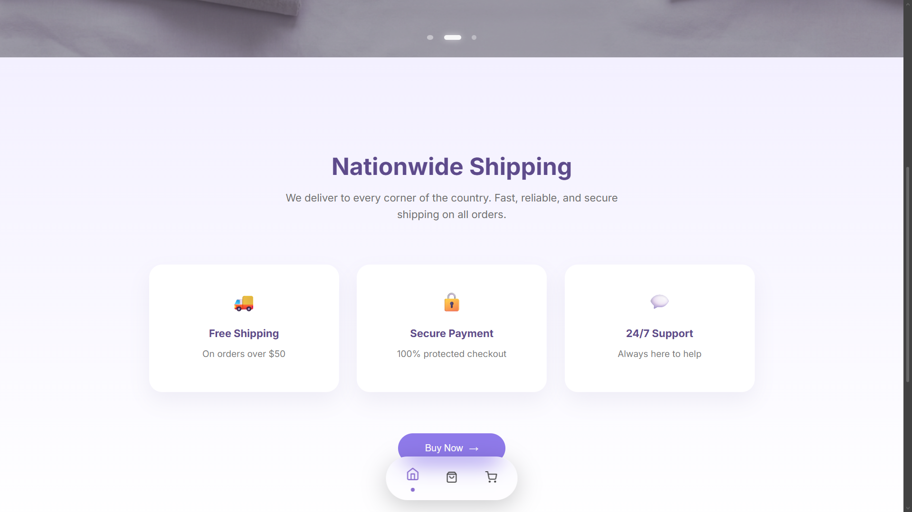
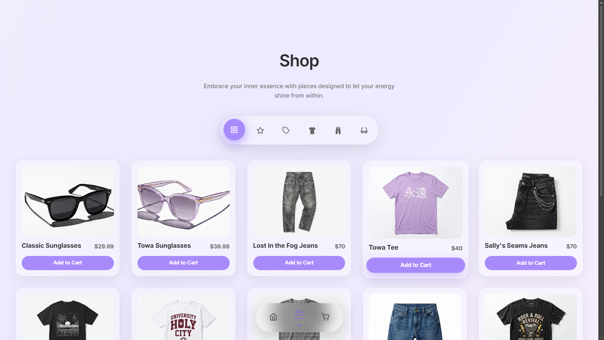
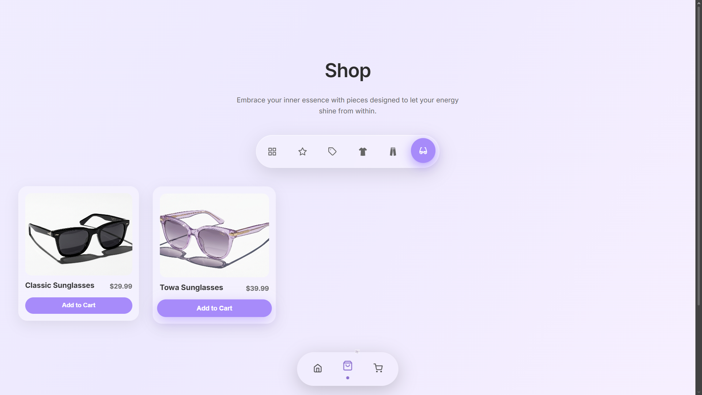
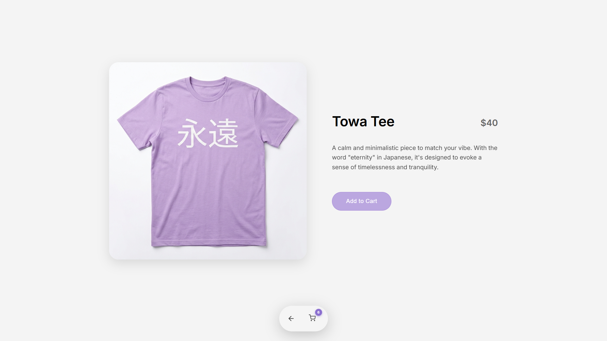
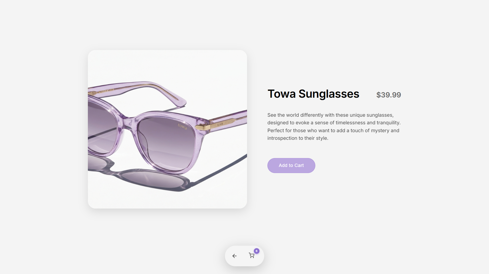
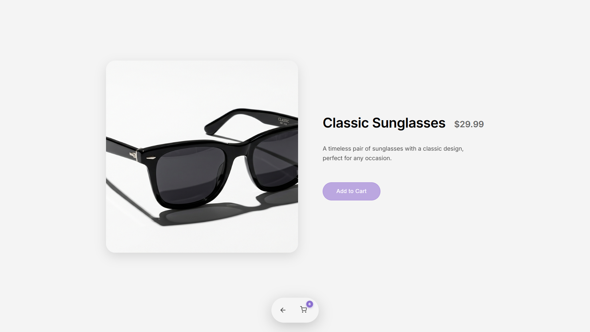
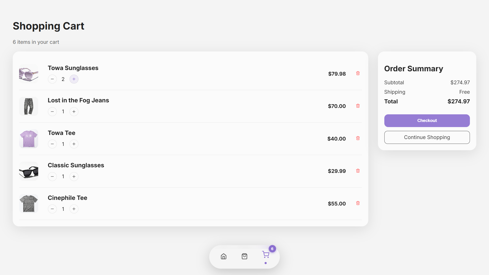
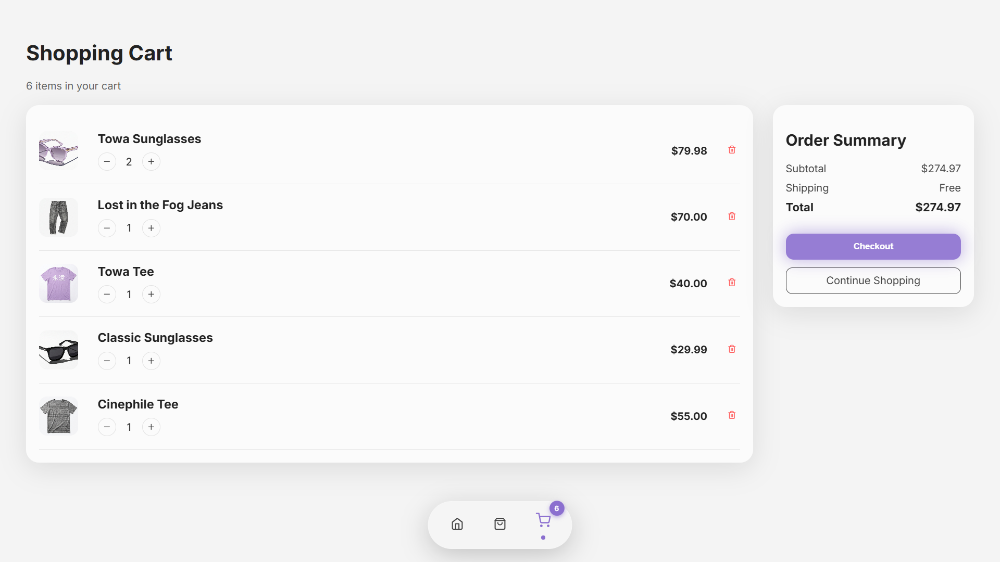

# 🌿 Lavender Shop

Lavender Shop is a modern e-commerce frontend built with React, JavaScript, HTML, and CSS. It focuses on a clean, minimal and elegant UI experience inspired by Apple-style design systems.

The project includes smooth page transitions, an interactive product catalog, a dynamic shopping cart system, and responsive layouts optimized for both desktop and mobile. It also features micro-interactions such as hover animations, swipeable hero sections, and fluid UI feedback to enhance user experience.

Lavender Shop was created as a practice project to strengthen frontend development skills, UI/UX design implementation, and component-based architecture using React.


## ✨ Features

- 🛍️ Product browsing & detail view
- 🛒 Cart with dynamic item counter
- 🎞️ Smooth page transitions (blur + fade)
- 🎠 Hero carousel with custom navigation
- 💫 Microinteractions (hover, ripple, animations)
- 📱 Fully responsive design

## 🧰 Tech Stack

- React
- React Router
- Swiper.js
- CSS (custom, glassmorphism UI)

## ⚙️ Notes
- This project was bootstrapped with Vite.


## 🚀 Live Demo

👉 https://lavender-shop.vercel.app

## 📸 Screenshots

### Home



### Shop



### Product Detail




### Cart




## 📦 Installation

```bash
git clone https://github.com/walterbardier/lavender-shop.git
cd lavender-shop
npm install
npm run dev